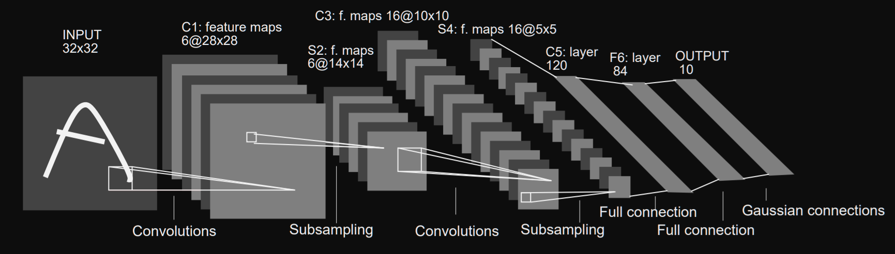
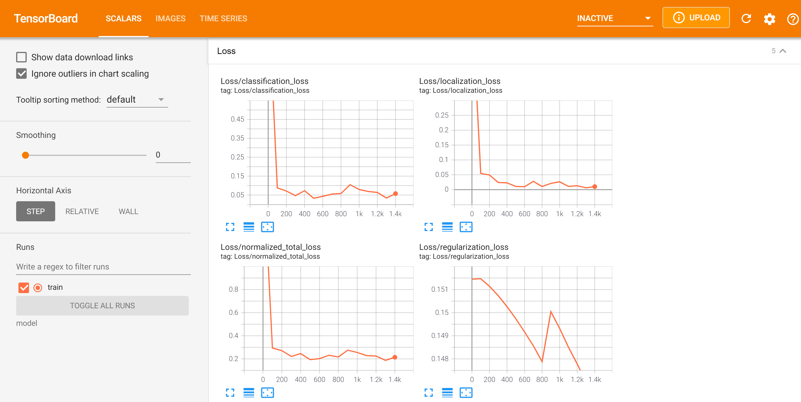

# Real time object detection

## About this notebook

This notebook contains a simple implementation of a Deep Learning model for **real time object detection**. In this particular case, the object to be detected is a **mask**.

The model presented in this repository has been totally implemented using open source tools (i.e., Python 3 and TensorFlow 2), and is designed to be run on an a system with a NVIDIA graphics card with CUDA architectures (so we can take advantage of *tensorflow-gpu* to speed up the training).

I got idea to design this model after watching one of the YouTube videos by [Nicholas Renotte](https://www.youtube.com/watch?v=yqkISICHH-U). Some of the steps followed in this project, resemble what he has done for other use cases (e.g., sign object detection). I also used an amazing graphical image annotation package, *LabelImg*, developed by [Tzuta Lin](https://github.com/tzutalin/labelImg).

Regarding the technical implementation of the model, we use *transfer learning* to load the neuron weights pre-trained on the [**ResNet50**](https://keras.io/api/applications/resnet/) model.

## ResNet50

Convolutional Neural Networks is the standard architecture for solving tasks associated with images (e.g., image classification). Some of the well-known deep learning architectures for CNN are LeNet-5 (7 layers), GoogLeNet (22 layers), AlexNet (8 layers), VGG (16–19 layers), and ResNet (152 layers).

For this project, we use LeNet-5, which has been successfully used on the MNIST dataset to identify handwritten-digit patterns. The LeNet-5 architecture is presented in the following schema.



## Data

The dataset used in this model, has been manually taken and labeled. To speed the processes, the repository includes a Python script that automatically takes pictures from your webcam every X seconds.


## Label the data

To annotate the images (i.e., assign the bounding box and the corresponding *Mask* vs *No-mask* class), we used the [LabelImg](https://github.com/tzutalin/labelImg) library.


## Requirements

* Python 3
* Tensorflow 2

## How to run the Notebook

Clone this repository and navigate to the main folder. To do so, open your Terminal (for MacOS/Linux) or your Command Prompt (for Windows) and run the following commands:
```
git clone https://github.com/guillermo-lahuerta/Real_time_object_detection.git
cd ./Real_time_object_detection/
```

I strongly suggest to create a virtual environment with Conda to manage dependencies and isolate projects. After installing [Miniconda](https://docs.conda.io/en/latest/miniconda.html), run the following commands to update the base conda packages:
```
conda update conda
conda update python
conda update --all
```

Then, create the new conda environment called *object_detection* to store all the dependencies related to this repo:
```
conda create --name object_detection python=3.8.5
conda activate object_detection
```

Now, create a Jupyter Notebook kernel for the new environment:
```
conda install ipykernel jupyter
conda install -c conda-forge jupyter_nbextensions_configurator
conda install -c conda-forge jupyter_contrib_nbextensions
python -m ipykernel install --user --name object_detection --display-name "object_detection"
```

Now, install all required packages:
```
pip install -r requirements.txt
```

### Install TensorFlow
It's time to install *TensorFlow*:

* If you have a NVIDIA graphics card with CUDA architectures, you should consider installing *tensorflow-gpu* (instead of the regular *tensorflow*), to speed up your deep learning models. Rather than using *pip* or *conda* to try to figure out which version of TensorFlow you need, I recommend finding the exact "*.whl*" file from [TensorFlow](https://www.tensorflow.org/install/pip#package-location)’s site. Once you have the *url* of the corresponding TensorFlow version that you need, run the following command (substitute *<whl_url>* with the exact url):
```
pip install <whl_url>
```

* If you don't have a NVIDIA graphics card, you should use *Google Colab* or any other environment that allows GPU computing.

In order to monitor the training of the model, I also suggest to take advantage of *TensorBoard*, TensorFlow's visualization toolkit. With this tool, we can see the the performance of the model epoch after epoch (something extremely useful for Deep Learning models that need hours to be trained).



### Run the notebook
To run the app jupyter notebook, use these commands:
```
conda activate object_detection
jupyter notebook
```

If you try to open the notebook in a Windows environment and the Kernel fails, try running the following comand before opening the Notebook:
```
conda install pywin32
```

## Resources

* [TensorFlow](https://www.tensorflow.org/)
* [LabelImg](https://github.com/tzutalin/labelImg)
* [TFODCourse](https://github.com/nicknochnack/TFODCourse)
